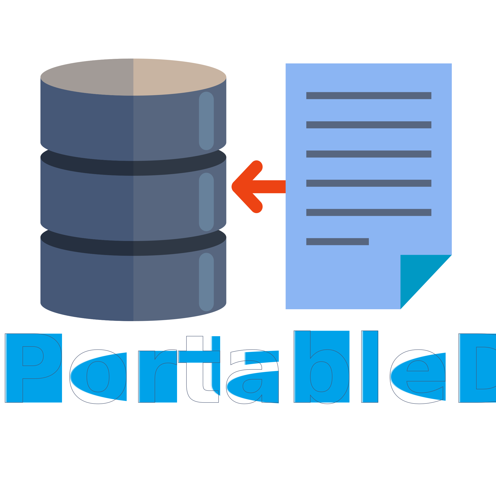

---

[](https://www.youtube.com/user/jefripunza/)
[](https://www.youtube.com/user/jefripunza/)
[](https://www.youtube.com/user/jefripunza/)
[](https://www.youtube.com/user/jefripunza/videos/)

# Donate

[](https://www.paypal.com/paypalme/jefripunza)

# Sosial Media

[](https://www.youtube.com/user/jefripunza/)
[](https://www.instagram.com/jefripunza/)
[](https://fb.com/jefripunza/)
[](https://twitter.com/jefripunza/)
[](https://www.linkedin.com/in/jefri-herdi-triyanto-ba76a8106/)

# Introduction

[](https://www.php.net/manual/en/)
[](https://www.javascript.com/)

Database adalah kumpulan informasi yang disimpan di dalam komputer secara sistematik sehingga dapat diperiksa menggunakan suatu program komputer untuk memperoleh informasi dari basis data tersebut. Dalam hal penyimpanan data diperlukan sebuah database yang digunakan untuk menyimpan data-data. Ada beberapa macam database yang sudah ada dan beberapa juga sudah banyak dikenal oleh para programmer salah satunya yang sering dipakai adalah MySQL. Nah project kali ini kita tidak akan menggunakan database apapun karena project ini sudah sangat-sangat portabel untuk menjadi sebuah database sederhana (tidak terkoneksi dengan database apapun). Project ini sangat cocok digunakan untuk menyimpan komentar atau konten-konten yang bisa dilihat secara umum.

---

<br />

# DEMO

<a href="https://jefripunza.github.io/portableDB" target="_blank" rel="norefferer">https://jefripunza.github.io/portableDB</a> <br/>

<br />

# PERSIAPAN

Langkah-langkah untuk menggunakan project ini :

## 1. Settings Password di PHP

```php
//Password
$PASSWORD = "password"; // change this, default: password
```

## 2. Settings di Website

### Tambahkan CDN yang dibutuhkan

```html
<script src="https://code.jquery.com/jquery-3.6.0.min.js" integrity="sha256-/xUj+3OJU5yExlq6GSYGSHk7tPXikynS7ogEvDej/m4=" crossorigin="anonymous"></script>
```

### Tambahkan Javascript untuk konektor

```javascript
const url = "/pDB.php", // change this if change PortableDB file
  password = "password"; // change this, default: password

function getData() {
  const data = JSON.parse(
    $.ajax({
      type: "GET",
      url: url + `?password=${password}&execute=list`,
      async: false,
    }).responseText
  );
  if (data.success) {
    return data.data;
  } else {
    return {
      message: "request error!",
    };
  }
}

function sendRequest(execute, object, callback) {
  $.post(url + `?password=${password}&execute=${execute}`, object).done(
    function (data) {
      const response = JSON.parse(data);
      callback(response);
    }
  );
}
```

<br />

# PENGGUNAAN

Didalam penggunaannya terdapat sistem CRUD yang di inisialkan sebagai <b>"execute"</b> yang terdiri dari <b>list, clear, add, edit, & delete</b>.

## List data

```javascript
function getData() {
  const data = JSON.parse(
    $.ajax({
      type: "GET",
      url: url + `?password=${password}&execute=list`,
      async: false,
    }).responseText
  );
  if (data.success) {
    return data.data;
  } else {
    return {
      message: "request error!",
    };
  }
}
```

## Clear data

```javascript
sendRequest("clear", {}, (response) => {
    if (response.success) {
        // ok
    } else {
        // error
    }
});
```

## Add data

Struktur data yang akan disimpan SANGAT BERGANTUNG pada object yang di kirim! <br/>
Misal, kita mempunyai object {name: name, message: message} maka struktur yang akan tersimpan di satu data ini mempunyai kolom / key name & message.

```javascript
sendRequest("add", {
        name,
        message,
    }, (response) => {
        if (response.success) {
            // ok
        } else {
            // error
        }
    }
);
```

## Edit data

Diwajibkan menggunakan index select menggunakan key <b>"id"</b> dan value nya dari nilai data <b>"_id"</b> untuk memilih data mana yang akan diubah dan menambahkan object lain selain <b>"id"</b> untuk merubah value nya (multi).

```javascript
sendRequest("edit", {
        id: "value from _id", // index select
        message, // change value from key
    }, (response) => {
        if (response.success) {
            // ok
        } else {
            // error
        }
    }
);
```

## Delete data

Diwajibkan menggunakan index select menggunakan key <b>"id"</b> dan value nya dari nilai data <b>"_id"</b> untuk memilih data mana yang akan dihapus.

```javascript
sendRequest("delete", {
        id: "value from _id", // index select
    }, (response) => {
        if (response.success) {
            // ok
        } else {
            // error
        }
    }
);
```

<br />

# DEVELOPMENT MODE

untuk menjalankan project ini secara development dengan cara (windows) buka file <b>webserver.bat</b> lalu isikan port : 8888

<br />

# Support the project

Apakah kamu menyukai project ini? Please support saya dengan menekan subscribe di [Youtube Channel](https://www.youtube.com/user/jefripunza/videos/) saya...

<br />

# Donation Please

Butuh ngopi gans, kasih lah untuk biaya pengembangan agar mudah membeli alat dan buat makan <br />
[](https://www.paypal.com/paypalme/jefripunza)
